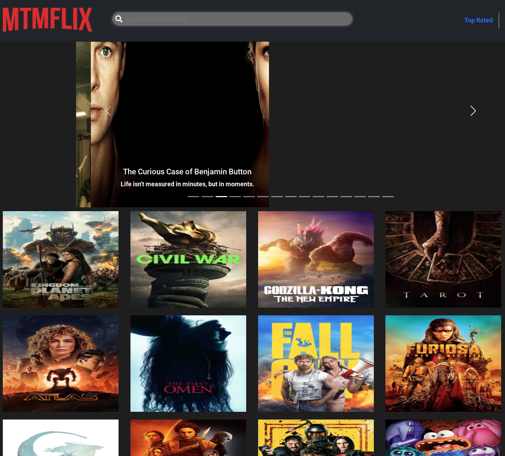
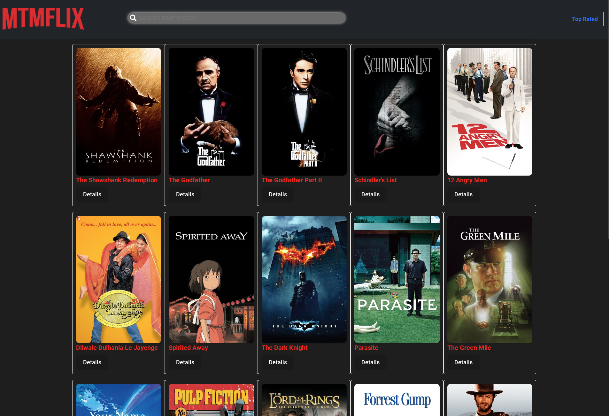
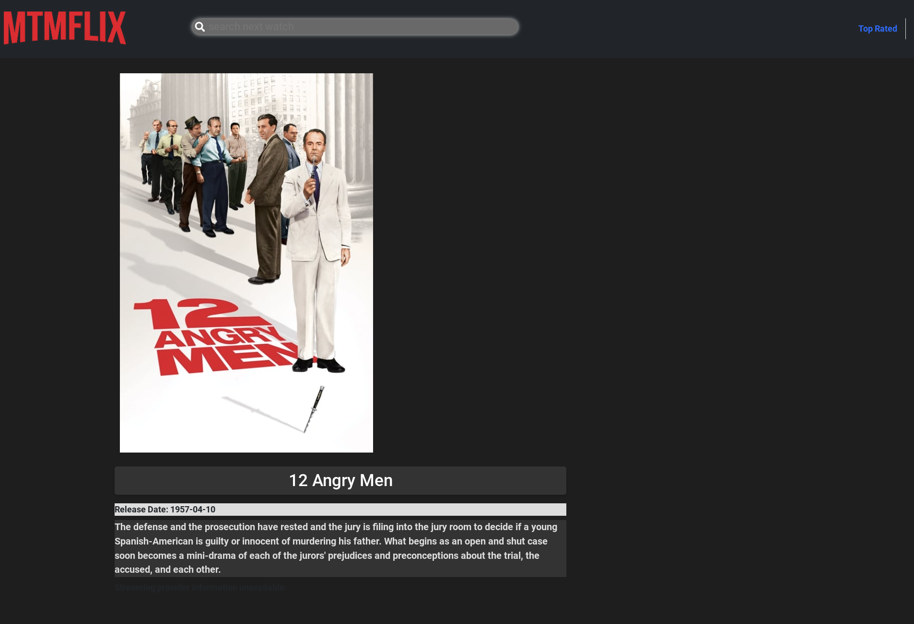
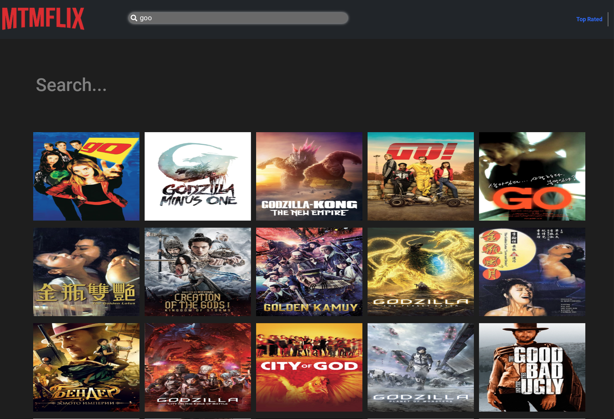
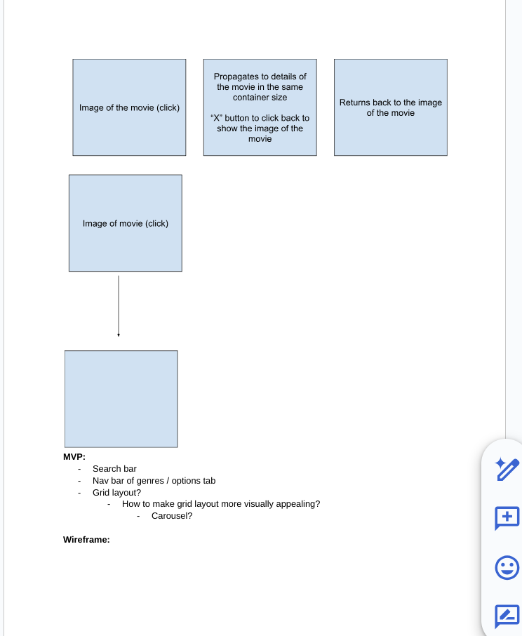
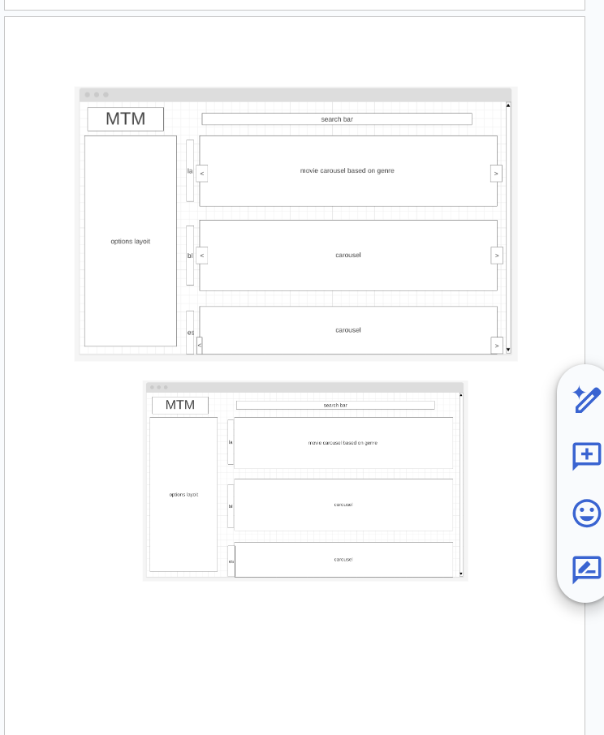
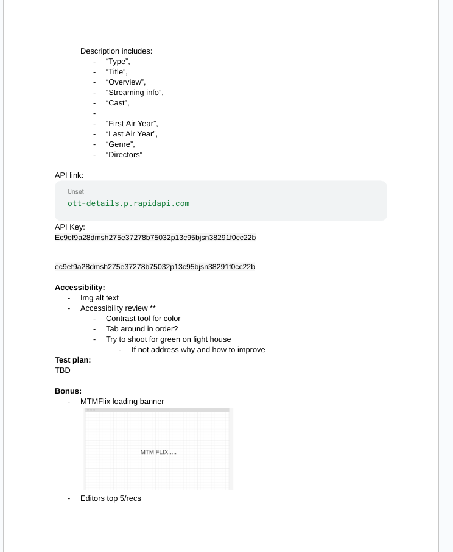
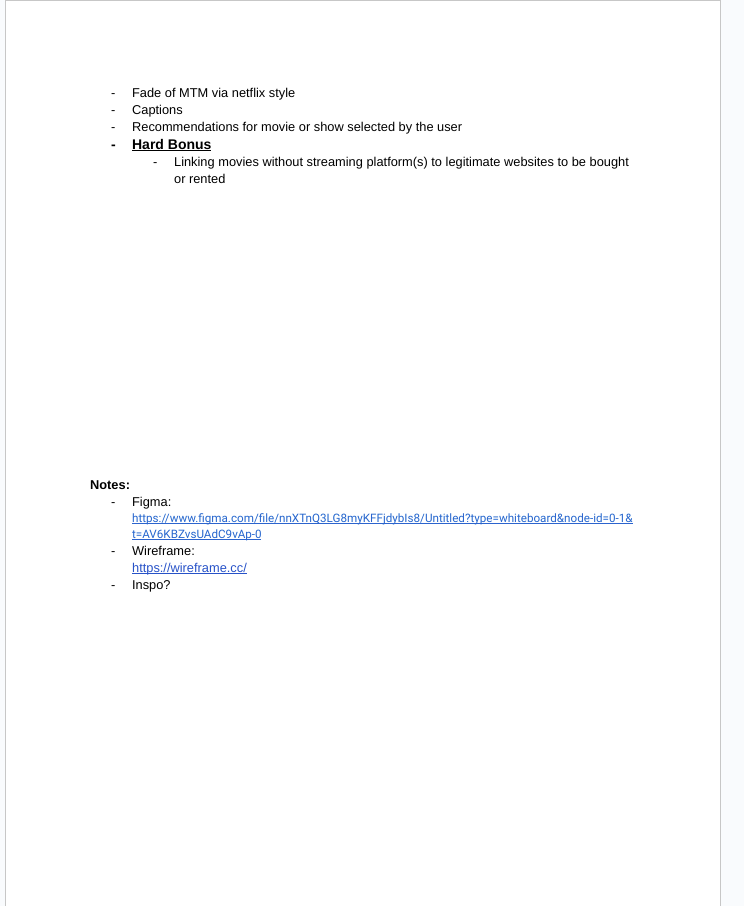
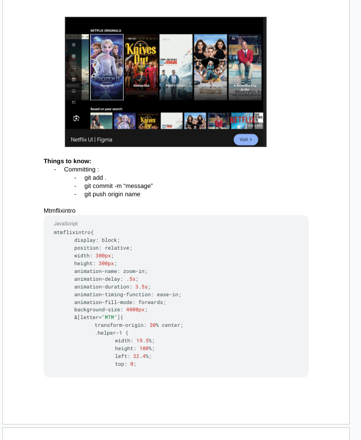

# React + Vite

# MTMFlix
MTMFlix App is made with pure Javascript, CSS, HTML, React, Vite and Bootstrap.
MTMFlix is a web application designed to help you find where your favorite movies are available to stream. Tired of searching through multiple streaming services to see ig a movie is available? MTMFlix makes it easy!

## Live Website
Coming soon..

## Features
- Search for Movies: Enter the title of a movie to see where it's streaming.
- Up-to-Date Streaming Information: MTMFlix strives to provide the most      current information on where movies are available to stream.
- User-Friendly Interface: The application is designed to be simple and intuitive to use.

## Screenshots

## Development

## Authors 
- Micheal Vela - [GitHub](https://github.com/Mikevela)
- Tina Sun - [GitHub](https://github.com/sun-tina)
- Meagan Hollingsworth - [GitHub](https://github.com/INKYGIRLnTech)

## Acknowledgment
- Laurie Corrin 
- Figma

## Getting Started
1. `npm install`
2. `npm run seed`
3. `npm run dev`
